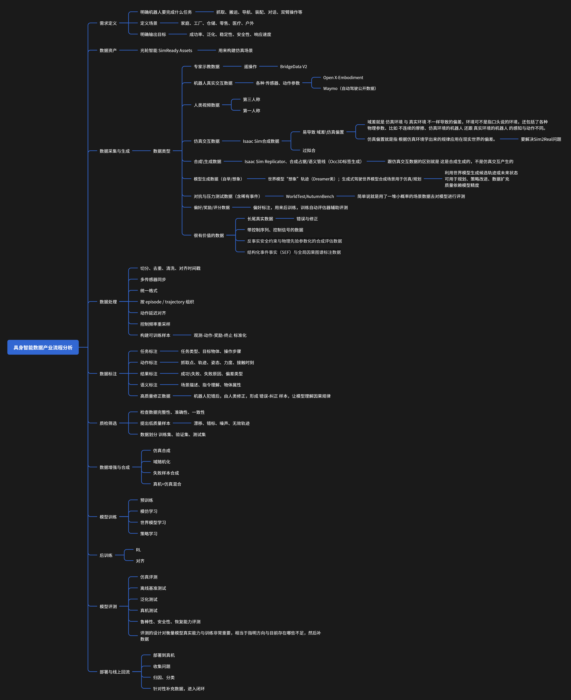

# World Models, Post-Training RL, Evaluation, High-Quality Data Labeling, and Evaluation Tooling

## Thoughts

- error data
- error-and-correction data
- post-training RL
- evaluation: how to define and filter high-quality data
- top-of-the-pyramid high-quality data
- robot brains may eventually generalize across many different robot types, but the data collected by different robots is not unified, so how should bias and mismatch be handled
- simulation
- Sim2Real, Real2Sim, domain gaps, and simulation bias
- physical consistency
- causal reasoning
- counterfactual rollout
- SimReady
- multi-step operation error accumulation

We need to first sort out the entire process and then refine it. That requires a structure closer to a mind map or layered bullet system.

What now feels most valuable to me is an **evaluation-driven data loop**: a closed loop where evaluation guides the direction of model evolution.

## AI Infra Pipeline Diagram

## Evaluation

Given a rollout, a video, or a trajectory, the system should output:

- PhysicsScore
- ControlScore
- TaskScore

## Diagnosis

The system should be able to tell the user what went wrong, for example:

- object penetration / impossible collision
- sudden trajectory mutation
- object identity inconsistency after occlusion
- action changes that do not lead to a reasonable state transition

## Closed loop

The evaluation results should be converted into:

- hard cases
- preference pairs
- verifiable rewards
- physically verifiable rewards (RLVR)
- automated causal reasoning extraction

That can be extended further into:

- deep test benchmarks for counterfactual reasoning and physical rules
- dense temporal reasoning evaluation in real-world scenarios
- structured event facts (SEF) and causal relation graphs

## Directional analysis for world-model data

One thing that must be kept in mind is that the product has to connect seamlessly with upstream and downstream workflows.

### A core issue

Many current world models work by using first-person perspectives to control and generate a world in real time, almost like open-world generative systems. A lot of people look at this and ask: what is this actually useful for?

The practical reason is that internet video data is the largest and easiest source of training data. The goal there is to learn how the world changes.

But robot data with action instructions and parameters is scarce. You do not only need data about what the robot saw. You also need to know:

- what action was executed
- how the robot arm joints moved
- when the gripper closed
- how force and contact changed

So the real question of a robot world model is:

**if I perform these actions, how will the world change next?**

That is different from VLA.

- VLA / policy models: learn to output the correct actions
- robot world models: predict how the world will change when actions are taken

If world modeling and policy are split apart, then large-scale video and interaction data can first be used to learn physical change itself, and only afterward can a smaller amount of high-quality robot action data be used to align the control interface.

### Another core issue

The metrics and modules across different benchmarks are not unified.

But the essence of embodied intelligence is closed-loop coupling, not isolated subproblems.

A model may score very highly on one benchmark and still perform poorly in reality.

So what makes more sense to me is this:

a unified evaluation framework means one shared task setting, one shared data protocol, one shared interaction process, and one shared evaluation standard, while still preserving decomposed sub-metrics inside that framework.

What really matters is multidimensional decomposed evaluation inside a unified framework.
