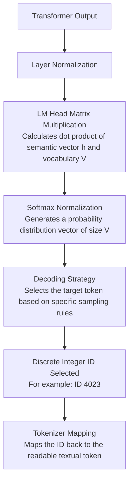

# Deep Dive into Attention and the Full LLM Decoding Pipeline

## Abstract

How do Large Language Models (LLMs) accurately predict the next word? This article takes you behind the scenes of the core Transformer components. We deeply analyze how the Multi-Head Attention mechanism prevents gradient vanishing through scaling, and unveil the high-dimensional design philosophy of the MLP layer, which is regarded as the model's "knowledge base." From layer normalization to final decoding, this is a hardcore end-to-end walkthrough of the entire information flow.

## 1. Pre-learning Resource

- Visualization Tool: Strongly recommend using this interactive LLM visualization for pre-learning: [https://bbycroft.net/llm](https://bbycroft.net/llm)

## 2. Core Components

### Layer Normalization

The core purpose of Layer Normalization is to restrict the feature data flowing inside the model within a reasonable range, usually a distribution with a mean of 0 and a variance of 1, in order to ensure training stability. However, RMSNorm (Root Mean Square Normalization) does not strictly create a distribution with a mean of 0 and a variance of 1. Instead, for parameters closer to 0, their variance is closer to 1.

- RMS calculation:

$$
\mathrm{RMS}(x) = \sqrt{\frac{1}{d}\sum_{i=1}^{d} x_i^2 + \epsilon}
$$

- RMSNorm calculation:

$$
\mathrm{RMSNorm}(x) = \frac{x}{\mathrm{RMS}(x)} \odot \gamma
$$

Where `\gamma` represents the scaling factor.

For further details, please refer to the dedicated section on Layer Normalization.

### Softmax

The role of the Softmax function is to convert a chaotic, arbitrarily ranged set of real numbers output by the model, usually called logits, into values that comply with a probability distribution, namely the predicted probability for each word. This allows the model to "elegantly" choose the next token to output by transforming activation values into a valid probability distribution where the sum equals 1 and all values are positive.

### Activation Functions

The core role of activation functions has evolved from early "purely providing non-linearity" into acting as the "steering wheel" and "dynamic filter" of the internal information flow.

## 3. Advanced Subsystems

### Self-Attention

The mechanism utilizes multiple groups of heads, where each head possesses its own $Q$, $K$, and $V$ matrices.

- Dimension Alignment: The final combined dimensions of these attention heads must align with the hidden layer; otherwise, the matrix multiplication cannot proceed.
- Example: For a hidden layer dimension $d_{model} = 4096$ distributed across 32 heads, the dimension of each head $d_k$ must be 128. This is because the attention outputs must eventually be aggregated into a final $V$ output vector whose total dimension matches the hidden layer. In Transformer design, this process is known as Multi-Head Attention Concat & Projection.
- Internal Pipeline:

1. Layer Normalization
2. Linear Projection: Multiply by weight matrices to obtain $Q$, $K$, and $V$.
3. RoPE Position Embedding: Applied exclusively to $Q$ and $K$.
4. Scaled Dot-Product: The dot product of $Q$ and its corresponding $K$ is divided by $\sqrt{d_k}$ to obtain the attention matrix.

Why divide by $\sqrt{d_k}$? The purpose is to keep the variance within a stable range. For instance, with 128 dimensions, the raw dot-product variance represents the cumulative variance of the weighted sum across all dimensions, which scales up significantly. If passed directly into Softmax, large values would become dominant while smaller values would drop nearly to 0, causing severe gradient vanishing.

5. Causal Mask
6. Softmax

### MLP (Multi-Layer Perceptron)

The MLP layer functions effectively as the model's knowledge base. Architecturally, it achieves this because it naturally represents the hidden semantic profiles of features by projecting them into a much higher dimensional space through up-projection.

- The Black Box Reality: You cannot absolutely claim that the MLP layer is 100% pure knowledge representation or that the Attention layer is 100% pure attention routing. The model architecture is designed first and then trained end-to-end. While empirical ablation studies show which additions or removals optimize specific behaviors, they ultimately demonstrate high correlation rather than absolute functional separation.
- Dimensionality Rule of Thumb: The internal dimension of the MLP matrix typically scales to 2.6 to 4 times the size of $d_{model}$. Models consistently yield peak performance within this specific empirical range.
- Internal Pipeline:

1. Layer Normalization
2. MLP Matrix Projection (Up-projection)
3. Activation Function
4. MLP Down-Projection Matrix: Maps the representation back to the original dimension and adds the result back into the residual stream.

## 4. Transformer Structure and Decoding Pipeline

### Overall Structure

A complete Transformer model is constructed by stacking many sequential combinations of Self-Attention and MLP blocks.

### Final Output and Decoding Flow

This stage converts the raw hidden states output by the final Transformer layer into actual discrete output tokens through the following sequence:

- LM Head Details: The LM Head matrix dimensions are defined by $V \times d_{model}$, where $V$ represents the total vocabulary size. It computes the inner product, or dot product, between the final context semantic vector $h$ and all candidate tokens in the vocabulary. A larger dot product indicates a higher semantic match between the context and that specific word.
